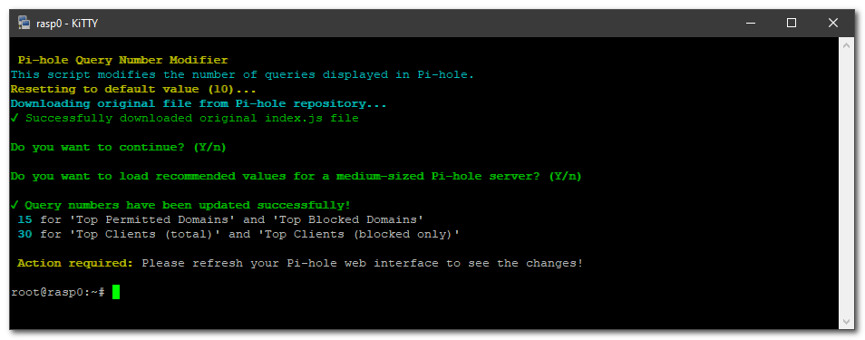
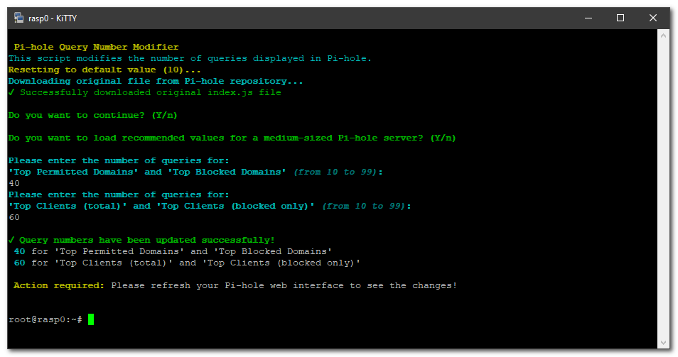

# pihole-change-queries-number
**This script changes queries number shown in pihole v5.  
This script is incompatible with pihole v6.**  

First it reset to default pihole settings (10). After you can choose between:

Optimal mode (for medium server)

Manual mode (allowed from 10 to 99 queries)

