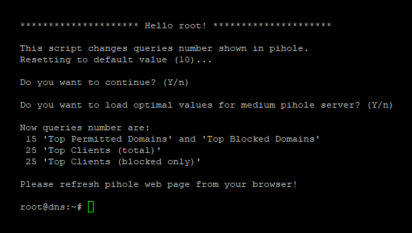
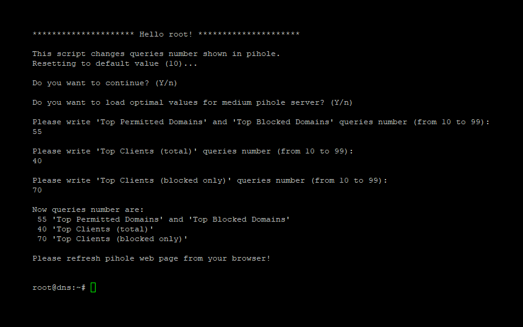
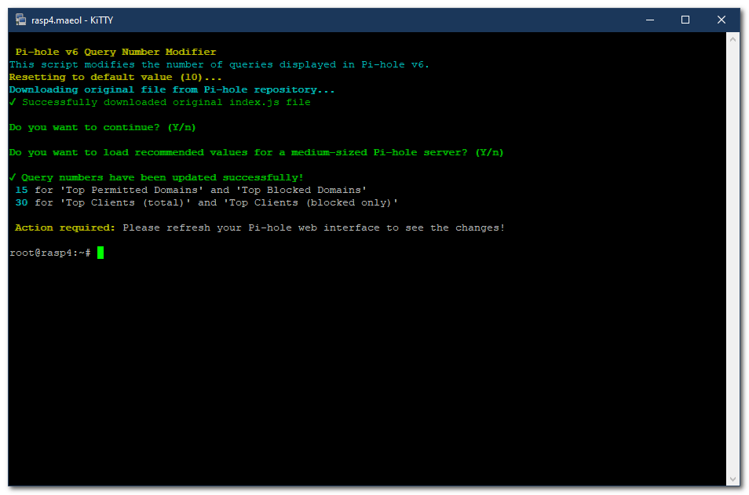
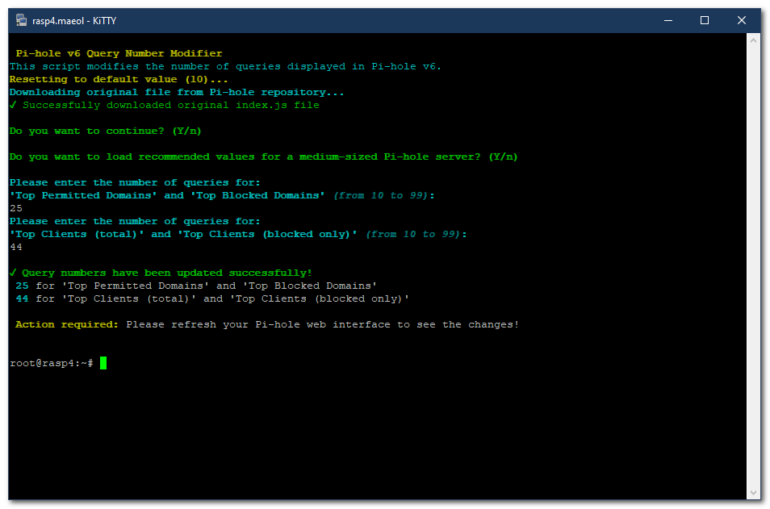
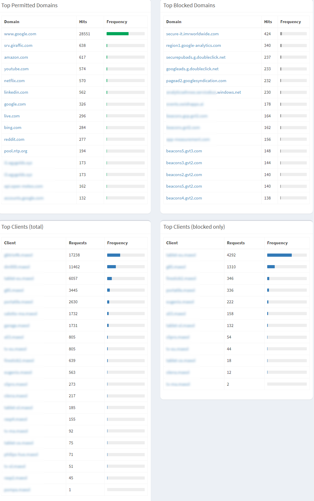

# Pi-hole Query Number Modifier

A collection of scripts to customize the number of queries displayed in Pi-hole's dashboard for both v5 and v6.

## Overview

These scripts allow you to modify how many queries are displayed in various sections of the Pi-hole dashboard, including:
- Top Permitted Domains
- Top Blocked Domains
- Top Clients (total)
- Top Clients (blocked only)

## Version Compatibility

- `pihole-change-queries-number_v5.bash` - Compatible with Pi-hole v5
- `pihole-change-queries-number_v6.bash` - Compatible with Pi-hole v6

## Features

- Reset to default values (10 queries)
- Predefined optimal values for medium-sized servers
- Custom configuration (10-99 queries)
- Color-coded terminal output (v6 script)
- Restore functionality
- User-friendly interactive interface

## Prerequisites

- Root access to your Pi-hole server
- Running Pi-hole v5 or v6 installation
- Basic command line knowledge

## Installation

1. Clone this repository:
   ```bash
   git clone https://github.com/mapi68/pihole-script.git
   ```

2. Navigate to the script directory:
   ```bash
   cd pihole-script
   ```

3. Make the script executable:
   ```bash
   chmod +x pihole-change-queries-number_v6.bash  # For Pi-hole v6
   # OR
   chmod +x pihole-change-queries-number_v5.bash  # For Pi-hole v5
   ```

## Usage

### For Pi-hole v6:
```bash
sudo ./pihole-change-queries-number_v6.bash
```

### For Pi-hole v5:
```bash
sudo ./pihole-change-queries-number_v5.bash
```

## Configuration Options

### Pi-hole v5

#### Optimal Mode (Recommended for medium servers)

*Pi-hole v5 Optimal Mode Configuration*
- Sets optimized values for a medium-sized Pi-hole server
- Top Domains: 15 entries
- Top Clients: 30 entries

#### Manual Mode

*Pi-hole v5 Manual Configuration*
- Customize the number of entries (10-99) for:
  - Top Permitted Domains
  - Top Blocked Domains
  - Top Clients (total)
  - Top Clients (blocked only)

### Pi-hole v6

#### Optimal Mode

*Pi-hole v6 Optimal Mode Configuration*
- Sets optimized values for a medium-sized Pi-hole server
- Enhanced color-coded interface
- Top Domains: 15 entries
- Top Clients: 30 entries

#### Manual Mode

*Pi-hole v6 Manual Configuration*
- Modern interface with color-coded messages
- Customize the number of entries (10-99) for:
  - Top Permitted Domains
  - Top Blocked Domains
  - Top Clients (total)
  - Top Clients (blocked only)

#### Dashboard Result

*Pi-hole Dashboard View (Same layout for both v5 and v6)*

## After Installation

After running the script, you'll need to:
1. Refresh your Pi-hole web interface
2. The new query numbers will be displayed in the dashboard

## Troubleshooting

- If you encounter any issues, the script will automatically download the original file from Pi-hole repository (v6)
- Error messages are color-coded for easy identification
- Invalid inputs are properly handled with appropriate error messages

## Reverting Changes

The script automatically resets to default values (10) before applying new ones. If you need to revert:
1. Run the script again
2. Choose to exit after the reset

## License

This project is licensed under the MIT License - see the [LICENSE](LICENSE) file for details.

## Author

- [@mapi68](https://github.com/mapi68)

## Support

If you encounter any issues or have questions, please [open an issue](https://github.com/mapi68/pihole-script/issues) on the GitHub repository.

## Contributing

Contributions are welcome! Please feel free to submit a Pull Request.