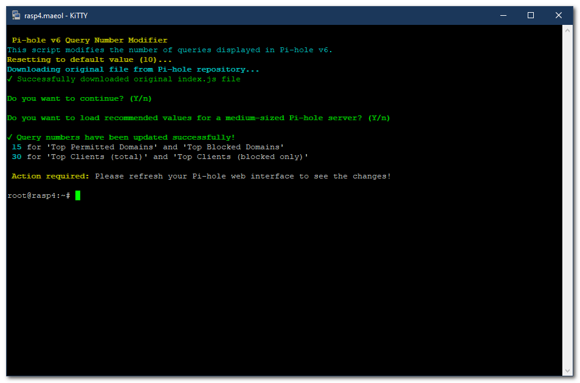
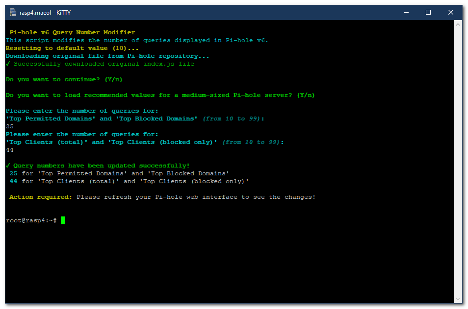
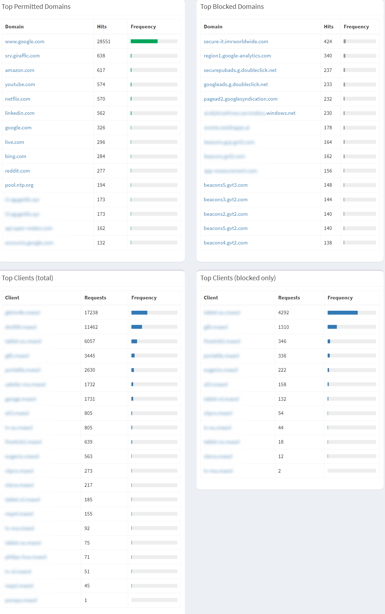

<p align="center">
  
  
  
  
</p>

<h1 align="center">🛠️ Pi-hole Scripts Collection</h1>

<p align="center">
  <strong>A collection of utility scripts to extend and customize your Pi-hole installation.</strong>
</p>

<p align="center">
  <a href="#overview">Overview</a> •
  <a href="#scripts">Scripts</a> •
  <a href="#install">Install</a> •
  <a href="#usage">Usage</a> •
  <a href="#troubleshooting">Troubleshooting</a>
</p>

<p align="center">
  <a href="https://ko-fi.com/mapi68">
    
  </a>
</p>

---

## 🌟 Overview <a name="overview"></a>

A growing collection of Bash scripts to manage, customize, and extend Pi-hole beyond its default capabilities — including dashboard tweaks, cron job management, and live system monitoring.

---

## 📦 Scripts <a name="scripts"></a>

### 📊 1. Pi-hole Query Number Modifier

Modify how many entries are displayed in the Pi-hole dashboard (Top Permitted Domains, Top Blocked Domains, Top Clients).

| Script | Compatible With |
|---|---|
| `pihole-change-queries-number_v5.bash` | Pi-hole v5 |
| `pihole-change-queries-number_v6.bash` | Pi-hole v6 |

#### Features

| Feature | Description |
|---|---|
| 🔄 **Reset** | Restore default values (10 queries) |
| ⚡ **Optimal Mode** | Predefined values tuned for medium-sized servers |
| 🎛️ **Manual Mode** | Custom configuration from 10 to 99 queries |
| 🎨 **Color Output** | Color-coded terminal interface |
| 🖥️ **Interactive UI** | User-friendly guided setup |

#### Configuration

**Optimal Mode** — Sets Top Domains to 15 entries and Top Clients to 30 entries.



**Manual Mode** — Full control over all query number settings (10–99).



**Dashboard Result**



---

### ⏰ 2. Pi-hole Cron Manager

Manage Pi-hole scheduled tasks from an interactive menu. Applies, removes, and monitors cron jobs for Pi-hole — with no manual editing of cron files required.

| Script | Compatible With |
|---|---|
| `pihole-cron-manager.bash` | Pi-hole v5 & v6 |

#### Features

| Feature | Description |
|---|---|
| ✅ **Apply / Restore** | Writes the default schedule to `/etc/cron.d/pihole_custom` and restarts cron |
| 🗑️ **Remove** | Deletes the cron file with confirmation |
| 📋 **Show Log** | Displays the last 30 lines of the updateGravity log |
| ▶️ **Run Now** | Runs `updateGravity` immediately with live output |
| 🖥️ **Interactive UI** | Menu-driven with return-to-menu after each action |

#### Default Schedule

```
5 5 * * 1-6   root   pihole updateGravity > /var/log/pihole_updateGravity.log
```

> **updateGravity** runs Monday through Saturday at **05:05**, with output saved to `/var/log/pihole_updateGravity.log`.

---

### 📡 3. Pi-hole Status Report

A live terminal dashboard that auto-refreshes every 10 seconds, showing a full overview of your Pi-hole instance — functionality not available natively in Pi-hole.

| Script | Compatible With |
|---|---|
| `pihole-status-report.bash` | Pi-hole v6 |

#### Features

| Feature | Description |
|---|---|
| 🔄 **Live Refresh** | Auto-updates every 10 seconds |
| 📦 **Versions** | Pi-hole and FTL current version |
| ⏱️ **Uptime** | System uptime at a glance |
| ⚙️ **Services** | Status of pihole-FTL and cron |
| 📊 **Queries Today** | Total queries, blocked count, block rate with visual bar |
| 🌍 **Gravity** | Number of domains in the gravity database |
| 💾 **Resources** | RAM and disk usage with visual bars |
| 🚫 **Top Blocked Domains** | Top 5 domains blocked today |
| 🖥️ **Top Clients** | Top 5 clients by query count |

#### Notes

- Uses the Pi-hole v6 REST API (`/api/`) for all data
- Authenticates automatically via `/etc/pihole/cli_pw`
- Press `Ctrl+C` to exit cleanly

---

## 📋 Prerequisites <a name="prerequisites"></a>

- Root access to your Pi-hole server
- Running Pi-hole v5 or v6 installation
- Basic command line knowledge

---

## 🛠️ Install <a name="install"></a>

Clone the repository and make scripts executable:

```bash
git clone https://github.com/mapi68/pihole-script.git
cd pihole-script
chmod +x *.bash
```

---

## 📝 Usage <a name="usage"></a>

### Query Number Modifier

For Pi-hole v6:
```bash
sudo ./pihole-change-queries-number_v6.bash
```

For Pi-hole v5:
```bash
sudo ./pihole-change-queries-number_v5.bash
```

### Cron Manager

```bash
sudo ./pihole-cron-manager.bash
```

After running the query modifier, refresh your Pi-hole web interface to see the updated numbers.

### Status Report

```bash
sudo ./pihole-status-report.bash
```

Press `Ctrl+C` to exit the live dashboard.

---

## ❗ Troubleshooting <a name="troubleshooting"></a>

- The query modifier script (v6) automatically re-downloads the original `index.js` from the Pi-hole repository before applying changes
- Error messages are color-coded for easy identification
- Invalid inputs are handled gracefully with clear error messages
- The cron manager shows the current active schedule at startup before any action is taken
- The status report requires Pi-hole v6 and authenticates automatically via `/etc/pihole/cli_pw`

### Reverting Query Number Changes

Run the script again and choose to exit after the reset step — this restores the default value of 10.

### Reverting Cron Changes

Run `pihole-cron-manager.bash` and choose option **2 (Remove)** to delete the custom cron file, or option **1 (Apply)** to restore the default schedule.

---

## 📄 License

This project is licensed under the [MIT License](LICENSE).

---

## 👤 Author

- [@mapi68](https://github.com/mapi68)

If you encounter any issues or have questions, please [open an issue](https://github.com/mapi68/pihole-script/issues) on GitHub. Contributions and Pull Requests are welcome!

---

## ☕ Support

<p align="center">
  <a href="https://ko-fi.com/mapi68">
    
  </a>
</p>

---

<p align="center">
  Made with ❤️ for the Raspberry Pi community
</p>
